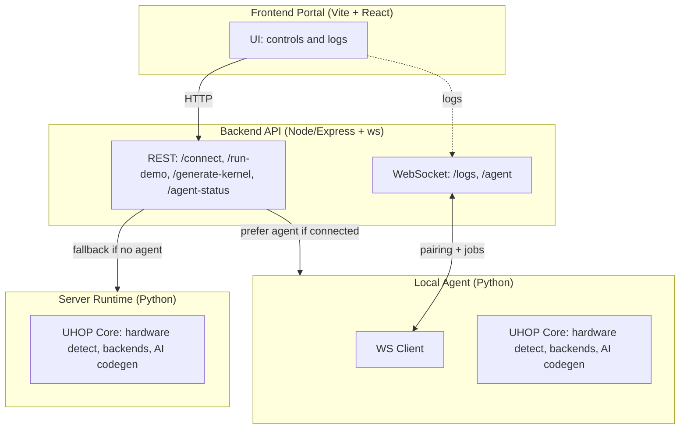

# UHOP — Universal Hardware Optimization Protocol

[](https://github.com/sevenloops/uhop/actions/workflows/deploy-frontend-pages.yml)

Live demo: [demo](https://uhop.dev)

UHOP is an AI-powered runtime kernel optimizer. It detects your hardware and picks the best available backend, optionally generating and validating kernels with AI, then caches the fastest path for reuse.

What UHOP supports today:

- Backend detection and selection: Torch (CUDA, MPS, CPU), OpenCL (GPU/CPU), Triton (Linux), CPU fallback
- `@uhop.optimize("op")` decorator for drop-in acceleration (e.g., matmul)
- AI kernel generation (OpenAI) for OpenCL/CUDA/Python/Triton with optional validation and smoke tests
- On-disk caching of best kernel/implementation per device
- CLI for info, demos, AI codegen, and cache management
- Optional local Agent that lets the web portal run on your hardware

Planned additions (see `issues/`): multi-backend benchmarking matrix, AI kernel training loop, distributed optimization, tighter framework integration (PyTorch/JAX), richer dashboard.

---

## Requirements

- Python 3.10+
- OS: Windows/macOS/Linux
- Optional accelerators/drivers as applicable:
  - NVIDIA CUDA (for Torch CUDA / CUDA backends)
  - Vendor OpenCL runtime (AMD/Intel/NVIDIA) for OpenCL paths
  - Apple MPS (macOS, via Torch) for Apple Silicon
- Optional: OpenAI API key (`OPENAI_API_KEY`) for AI codegen
- Optional (for the web UI): Node.js 20+ if you want to build the frontend locally

## Install

Clone and install the Python package:

```bash
git clone https://github.com/sevenloops/uhop.git
cd uhop
pip install -e .
# or dev extras
pip install -e .[dev]
# alternatively
pip install -r requirements.txt
```

Extras (optional):

```bash
# AMD ROCm Python tooling
pip install -e .[amd]
# NVIDIA CuPy for CUDA experiments
pip install -e .[nvidia]
```

## Quickstart (CLI)

- Hardware overview:

```bash
uhop info
uhop info --json
```

- Matmul demo vs naive Python baseline:

```bash
uhop demo --size 192 --iters 3
# choose a specific OpenCL GPU if multiple
uhop demo --ocl-device 0
```

- Fused Conv2D+ReLU demo (OpenCL):

```bash
python -m uhop.cli demo-conv2d-relu --h 128 --w 128 --c-in 3 --c-out 32 --k 3 --stride 1 --padding 1
```

- AI code generation and validation (examples):

```bash
# Generate OpenCL matmul kernel, validate build, run smoke test
python -m uhop.cli ai-generate matmul --target opencl --validate --smoke

# Generate fused Conv2D+ReLU and benchmark vs baseline
python -m uhop.cli ai-generate-fused --stride 1 --padding 1
```

- Cache management:

```bash
uhop cache list
uhop cache show matmul
uhop cache clear
uhop cache invalidate --device cuda  # examples: mps, cuda, intel, amd
```

Environment knobs:

- `UHOP_OPENCL_DEVICE_INDEX=<idx>` — default OpenCL device override
- `UHOP_STRICT_VALIDATE=1` — tighten AI-kernel validation tolerances

## Online demo + Local Agent

- Static portal (GitHub Pages): https://sevenloops.github.io/uhop/
- By default, the portal runs on the server-side backend when available.
- To run on your own hardware, start the local agent, then open the portal; it will show “Agent: Connected” and prefer your device.

Quick agent start:

```bash
pip install uhop  # or: pip install -e .
# Production (TLS)
uhop-agent --server wss://api.yourdomain.com/agent --token YOUR_AGENT_TOKEN
# Local dev
uhop-agent --server ws://127.0.0.1:8787/agent
```

More details and troubleshooting: `docs/AGENT_QUICKSTART.md`.

## Minimal web API (optional)

Expose a safe HTTP API locally for the portal or external clients:

```bash
uhop web-api --host 0.0.0.0 --port 5824
# or
python -m uhop.web_api --host 0.0.0.0 --port 5824
```

Endpoints:

- GET `/health`
- GET `/info` (same as `uhop info --json`)
- POST `/demo/matmul` with `{ "size": 256, "iters": 3 }`

Docker:

```bash
docker build -t uhop-demo-api -f api.Dockerfile .
docker run --rm -p 5824:5824 uhop-demo-api
```

## Testing

Run the test suite (GPU-dependent tests will skip if no suitable device is available):

```bash
pytest -q
```

Targeted runs:

```bash
pytest -q tests/test_matmul.py
pytest -q -k "opencl or cuda or cpu"
```

## Contributing

Contributions are welcome! Please see `CONTRIBUTING.md` for how to propose changes and our development tips. A few quick notes:

- Keep public APIs stable unless there is a compelling reason to change
- Add or update tests when you change public behavior
- Prefer minimal, pinned dependencies and reproducible steps

## Roadmap (high level)

- Multi-backend benchmarking and selection policies (CUDA/OpenCL/Torch/Triton/CPU)
- Improved device detection and preferences (multi-GPU, vendor nuances)
- Automated correctness and performance validation for AI-generated kernels
- Local agent UX, security hardening, and dashboard polish
- Framework integrations and distributed optimization

## License

MIT © UHOP Systems

---

## Architecture at a glance

High level components and flow:



- Frontend: React SPA built with Vite and Tailwind/shadcn. Deployed to GitHub Pages under `/uhop/`. Talks to the backend via REST and a logs WebSocket.
- Backend: Node/Express server with a WebSocket endpoint for agent pairing at `/agent`. Routes compute to the Local Agent when available; otherwise executes on the server (Python UHOP).
- Local Agent: Lightweight Python client that connects to the backend over WS, runs UHOP operations (hardware info, demos, AI codegen) on your machine, streams logs, and returns results. Token-based pairing supported.
- UHOP Core (Python):
  - Device detection and backend selection: Torch (CUDA/MPS/CPU), OpenCL (GPU/CPU), Triton (Linux) with CPU fallback
  - `@uhop.optimize` decorator, caching, CLI tools, AI kernel generation/validation
- AI Codegen: Optional OpenAI usage when `OPENAI_API_KEY` is set (on agent or server). Validation and smoke tests help gate kernels.
