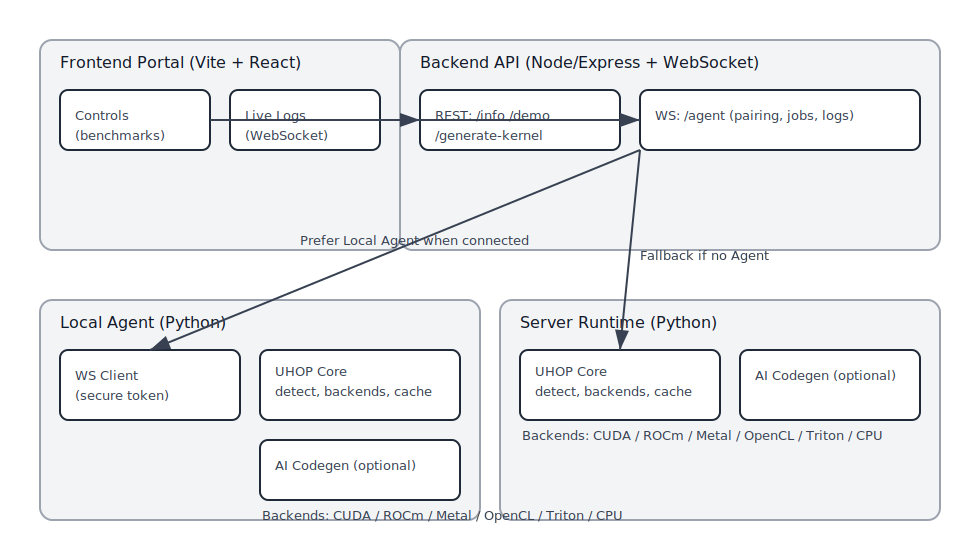

# UHOP — Universal Hardware Optimization Protocol

[](https://github.com/sevenloops/uhop/actions/workflows/deploy-frontend-pages.yml)

Live demo: [uhop.dev](https://uhop.dev)

UHOP is an open hardware optimization platform that unifies GPU acceleration across CUDA, ROCm/HIP, Metal, OpenCL, and future architectures. It detects your machine, dispatches to the best backend, can generate kernels with AI, validates them, and caches the fastest path for reuse — so developers can write simple code and run fast everywhere.

Key capabilities today:

- Automatic backend detection: Torch (CUDA/MPS/CPU), OpenCL (GPU/CPU), Triton (Linux), CPU fallback
- Drop‑in acceleration via `@uhop.optimize("op")` decorator (e.g., matmul)
- AI kernel generation (OpenAI) for OpenCL/CUDA/Python/Triton with validation/smoke tests
- On‑disk caching of selected kernels/implementations per device
- Friendly CLI for hardware info, demos, AI codegen, and cache tools
- Optional Local Agent so the web portal can run on your hardware

Vision: a universal, community-driven runtime optimizer that makes high‑performance computing approachable, portable, and fun — across vendors and form factors.

Planned (see `issues/`): multi‑backend benchmarking/policies, correctness suites, distributed training loops for AI‑generated kernels, richer dashboard, and tighter framework integrations (PyTorch/JAX).

---

## Architecture



The platform has four layers working together:

1) Frontend (Vite + React) — live controls, real‑time logs, and benchmarks
2) Backend (Node/Express + ws) — routes jobs to your Local Agent or server runtime
3) Local Agent (Python) — runs UHOP operations on your machine securely
4) UHOP Core (Python) — backends, optimizer, AI codegen/validation, caching

See also: `docs/architecture.svg` (source image) for sharing in blogs/slides.

At a glance, the request flow prefers the Local Agent when connected, and falls back to server‑side execution when not.

---

## Getting Started

Prereqs

- Python 3.10+
- OS: Windows, macOS, or Linux
- Drivers/toolchains as applicable: CUDA (NVIDIA), OpenCL runtime (AMD/Intel/NVIDIA), Apple MPS (macOS)
- Optional: `OPENAI_API_KEY` for AI codegen

Install

```bash
git clone https://github.com/sevenloops/uhop.git
cd uhop
pip install -e .            # install CLI `uhop`
# optional extras
pip install -e .[dev]       # tests & notebooks
pip install -e .[amd]       # ROCm Python tools
pip install -e .[nvidia]    # CuPy for CUDA
```

Verify your setup

```bash
uhop info
uhop info --json
```

Run a demo

```bash
# Matmul: naive Python vs UHOP‑optimized
uhop demo --size 192 --iters 3

# Fused Conv2D+ReLU (OpenCL). Choose device if multiple are present:
uhop demo-conv2d-relu --h 128 --w 128 --c-in 3 --c-out 32 --k 3 --stride 1 --padding 1
uhop demo-conv2d-relu --ocl-device 0
```

Try OpenCL elementwise add vs naive

```bash
python examples/opencl/compare_elementwise_add_opencl_vs_naive.py --size 2000000
```

Integrate in your code

```python
from uhop import optimize

@optimize("matmul")
def my_matmul(a, b):
    # write the simplest correct version — UHOP will dispatch/accelerate
    import numpy as np
    return np.array(a) @ np.array(b)
```

Environment knobs

- `UHOP_OPENCL_DEVICE_INDEX=<idx>` — default OpenCL device override
- `UHOP_STRICT_VALIDATE=1` — tighten AI‑kernel validation during codegen
- `UHOP_BACKEND_PREFERENCE=opencl,torch,triton,cpu,numpy` — override optimizer backend order (comma‑separated). Examples: `opencl,torch` to force OpenCL first; `torch,cpu` to prefer Torch; `numpy` to force baseline.
- `UHOP_OPENCL_MATMUL_IMPL=tiled|clblast` — prefer tiled GEMM (default) or request CLBlast (if installed; falls back with a warning).
- `UHOP_OPENCL_CONV_IMPL=auto|tiled|im2col_gemm` — choose Conv2D implementation. `auto` (default) uses a device+shape heuristic to prefer im2col+GEMM on larger shapes (requires CLBlast); `tiled` forces tiled; `im2col_gemm` forces im2col.
- `UHOP_OPENCL_VEC_CANDIDATES="1,4"` — optional compile-time vectorization candidates passed as `-D VEC=<w>` when building OpenCL kernels (current kernels default to `VEC=1`; future variants may use this to enable `float4` paths).

---

## Backend maturity

- Most optimized backend today: OpenCL (GPU) — broad op coverage with tuned/tiled kernels and a growing autotuning surface.
- In progress: CUDA (via Torch and AI CUDA), Apple MPS, and ROCm/HIP backends — parity work and optimizations are active.
- Coming later: CPU-optimized paths beyond Torch CPU, and Vulkan/other GPU APIs. Contributions are welcome to accelerate these paths.

---

## CLBlast integration (optional)

UHOP can use CLBlast for GEMM when available, enabling a BLAS-backed matmul and an im2col+GEMM path for Conv2D on OpenCL devices.

- Requirements: CLBlast shared library installed on your system (DLL/SO/Dylib)
        - Windows: clblast.dll (MSYS2/conda or vendor package)
        - Linux: libclblast.so (APT/Yum/Pacman or conda-forge)
        - macOS: libclblast.dylib (Homebrew/conda-forge)
- Discovery: We auto-detect via system library paths. You can set `CLBLAST_LIBRARY` to an absolute path if needed.
- Controls:
        - `UHOP_OPENCL_MATMUL_IMPL=clblast` — use CLBlast GEMM for matmul
        - `UHOP_OPENCL_CONV_IMPL=im2col_gemm` — use im2col+GEMM for Conv2D (per-batch im2col OpenCL kernel + CLBlast GEMM)

Notes:

- If CLBlast is not found, UHOP falls back to tiled kernels with a one-line warning.
- On Windows, some CLBlast builds and OpenCL driver stacks have calling‑convention mismatches or event‑handling quirks when called via ctypes. UHOP now:
        - Loads the DLL with WinDLL (stdcall) on Windows and CDLL elsewhere
        - Passes an explicit cl_event* out‑parameter (non‑NULL) to avoid NULL‑dereference bugs
        - Uses exact c_size_t/c_float/c_void_p arg types and row‑major leading dimensions (lda=k, ldb=n, ldc=n)
        If you still see an access‑violation in CLBlastSgemm, set `UHOP_OPENCL_CONV_IMPL=tiled` (default) and/or `UHOP_OPENCL_MATMUL_IMPL=tiled` to continue with stable tiled kernels.
- For best results, ensure your OpenCL ICD/runtime is installed and the CLBlast library matches your platform and driver stack. If multiple ICDs are present, try switching GPU vendors (AMD vs Intel) or updating drivers.

---

## AI Kernel Generation (optional)

```bash
# Generate OpenCL matmul, validate build, run smoke test
python -m uhop.cli ai-generate matmul --target opencl --validate --smoke

# Generate fused Conv2D+ReLU and benchmark vs current fused backend
python -m uhop.cli ai-generate-fused --stride 1 --padding 1
```

---

## Minimal Web API (optional)

Expose a local HTTP API for demos/automation:

```bash
uhop web-api --host 0.0.0.0 --port 5824
# or
python -m uhop.web_api --host 0.0.0.0 --port 5824
```

Endpoints

- GET `/health`
- GET `/info`
- POST `/demo/matmul` with `{ "size": 256, "iters": 3 }`

Docker

```bash
docker build -t uhop-demo-api -f api.Dockerfile .
docker run --rm -p 5824:5824 uhop-demo-api
```

---

## Contributing

We’re building UHOP as a friendly, long‑term open platform. All experience levels welcome — and we especially invite:

- GPU engineers (CUDA/ROCm/Metal/OpenCL)
- Compiler/runtime developers (Triton/MLIR/TVM)
- ML engineers and researchers (kernels, validation, datasets)
- Frontend devs (Vite/React/Tailwind, data viz)

Start here:

- Read `CONTRIBUTING.md` for local setup, tests, and PR tips
- Run `./contributing.sh setup` and `./contributing.sh test`
- Explore `issues/` for scoped design notes and milestones

Expectations:

- Keep public APIs stable; update docs/tests with behavior changes
- Aim for reproducible steps and minimal dependencies
- Small, focused PRs with clear titles (Conventional Commits encouraged)

---

## Roadmap

| Milestone | Focus | Status |
| --- | --- | --- |
| Pre‑MVP | Runtime decorator, hardware detection, caching, CLI demo | In progress |
| MVP | Multi‑backend benchmarking and selection policies | Planned |
| AI Kernels v1 | Automated validation, correctness suites, smoke tests | Planned |
| Dashboard | Logging, benchmark viz, local agent UX | Planned |
| Frameworks | PyTorch/JAX wrappers, training loop integration | Planned |
| All‑systems support | CUDA, ROCm/HIP, Metal, OpenCL (explore Vulkan/oneAPI) | Vision |
| All‑ops coverage | Elementwise, reductions, convs, attention, norms, fused ops | Vision |
| Protocol Spec v1.0 | Stable spec: device negotiation, cache manifests, kernel metadata | Vision |

See the `issues/` directory for detailed write‑ups:

- [01 Implement runtime decorator](issues/01-implement-runtime-decorator.md)
- [02 Hardware detection refinement](issues/02-pre-mvp-hardware-detection-refinement.md)
- [03 Caching metadata schema](issues/03-pre-mvp-basic-caching-metadata-schema.md)
- [04 CLI demo](issues/04-pre-mvp-cli-uhop-demo.md)
- [05 AI kernel validation](issues/05-pre-mvp-ai-kernel-validation.md)
- [06 Logging & benchmark viz](issues/06-pre-mvp-logging-benchmark-viz.md)
- [07 Multi‑backend benchmarking](issues/07-mvp-multi-backend-benchmarking.md)

---

## Good First Issues

Jump in with these approachable starters:

- Improve OpenCL/kernel templates and add simple correctness tests
- Add a CUDA/HIP example parity with the OpenCL elementwise add
- Enhance `uhop info --json` fields (driver versions, memory footprints)
- Add README snippets for Windows/Mac specific setup tips
- Polish the frontend build or add a minimal dashboard card
- Optimize CI/CD workflow and docs for PRs and promotions (badges, faster CI, templates) — see [issues/15-ci-cd-workflow-docs-promo.md](issues/15-ci-cd-workflow-docs-promo.md)

Or pick one from the tracked proposals above in `issues/` and comment to claim.

---

## Testing

Run the test suite (GPU‑dependent tests skip automatically):

```bash
pytest -q
```
 
Targeted runs:

```bash
pytest -q tests/test_matmul.py
pytest -q -k "opencl or cuda or hip or metal"
```

---

## License

MIT © UHOP Systems

---

Tags: gpu, compiler, rocm, cuda, opencl, metal, hpc, mlops, deep-learning, open-hardware
